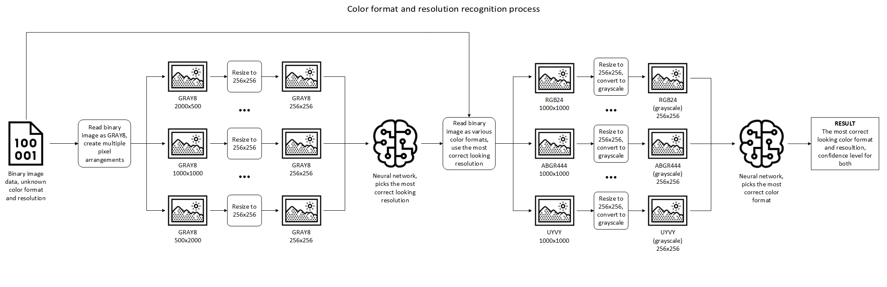

# image-recognizer

Recognize images color formats and resolutions based on their raw binary data.

## Description

image-recognizer can recognize color formats and resolutions of images based on their raw binary data. Application is written in Python and uses two Keras neural networks models to detect the correct color format and resolution. In addition, it is possible to use your own custom Keras neural networks models instead of default ones. 

## How does it work
Simplified image-recognizer operation principle can be seen on diagram below:

Application starts by loading raw binary data of a image. This data is then being interpreted as GRAY8 image and pixels are arranged into many possible resolutions (for example, a picture of one million pixels can be arranged in a resolution of 1000x1000 or 2000x500). Each generated arrangement is resized to 256x256 resolution and given as input to the resolution neural network. Resolution neural network picks the most "correct" looking resolutions. The application then generates image interpretations using all possible color formats with the resolution picked by the resolution neural network in the last step. Those interpretations are then resized to 256x256 resolution, converted to grayscale and given as input to the color format neural network. This neural network picks the most "correct" looking color format. At the output, the application gives the most correct looking color format and resolution with confidence levels for both.

## Usage

python app recognize <path_to_raw_file> <value_to_check> 
where value can be : [color_format, img_width, img_height, color_format_confidence, resolution_confidence]
